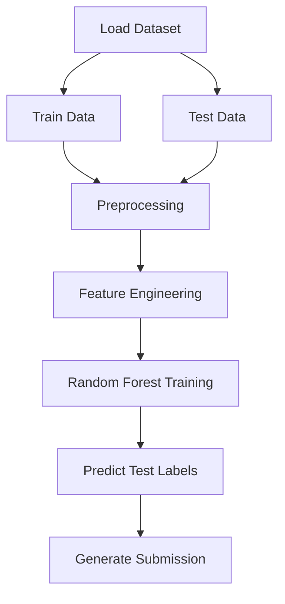

# Titanic Survival Prediction Model

A Random Forest classifier that predicts passenger survival on the Titanic, built on the classic [Kaggle Titanic competition](https://www.kaggle.com/c/titanic) dataset.

---
## Overview

Given passenger data (age, sex, ticket class, fare, etc.), the model predicts whether a passenger survived. This project covers the core data science workflow end to end: cleaning messy data, engineering features, and training a classifier.

---

## Features engineered

- **Title extraction** from passenger names (Mr, Mrs, Miss, Master, Rare), used both as a feature and to fill missing ages more accurately (grouped median by title rather than a single global median).
- **FamilySize** (`SibSp + Parch + 1`) and **IsAlone** flag, capturing whether travelling with family affected survival odds.
- **Missing value imputation**: `Age` (median per title group), `Fare` and `Embarked` (median/mode fallback).

---

## Model

`RandomForestClassifier` (scikit-learn), 300 trees, max depth 6, evaluated with 5-fold cross-validation before generating final predictions.

---

## Project structure

```
titanic-survival-prediction-model/
├── TSPM.py              # data loading, feature engineering, training, prediction
├── requirements.txt
├── README.md 
├── LICENSE
├── .gitignore
└── data/                # train.csv / test.csv go here (not committed)
```
---

## Workflow


---

## Setup

1. Clone the repo and install dependencies:
   ```bash
   pip install -r requirements.txt
   ```
2. Download `train.csv` and `test.csv` from the [competition data page](https://www.kaggle.com/c/titanic/data) and place them in a `data/` folder in the project root.
3. Run:
   ```bash
   python train_model.py
   ```
   This prints the cross-validation accuracy and writes predictions to `submission.csv`.

---

## Results

5-fold cross-validation accuracy: ~0.82–0.84 (varies slightly by run due to random forest stochasticity).

---

## Credits

Based on the [Kaggle "Titanic - Machine Learning from Disaster"](https://www.kaggle.com/c/titanic) getting-started tutorial, extended with additional feature engineering.
